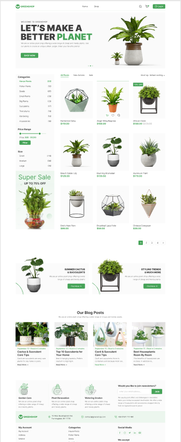

# Greenstore

Greenstore is your go-to destination for beautiful floral arrangements and unique gifts. We offer a wide selection of fresh, seasonal, and exotic flowers, as well as handcrafted bouquets for all occasions. Committed to quality and customer satisfaction, we bring beauty and elegance to every event and space.

[figma](https://www.figma.com/design/L5nSIG7ygm2x2KFvWPnok6/GreenShop?node-id=0-1&t=JWdCE7KRuejoNi2W-0)




## Table of Contents
- Features
- Technologies Used
- Getting Started
  - Prerequisites
  - Installation
  - Running the Application
- Project Structure
- Usage
- Contributing
- License
- Contact

## Features
- Wide Selection: Fresh, seasonal, and exotic flowers
- Handcrafted Bouquets: Perfect for all occasions
- User-Friendly Interface: Easy navigation and ordering
- Responsive Design: Looks great on all devices
- High-Quality Images and Descriptions: Accurate and detailed
- Secure Online Ordering: Safe and convenient

## Technologies Used
- Frontend Framework: Vite
- Styling: Tailwind CSS
- Programming Language: TypeScript
- Library: React

## Getting Started
#### Prerequisites
#### Ensure you have the following installed:

- Node.js (version 14.x or higher) - Download Node.js
- npm (version 6.x or higher) or yarn (version 1.x or higher) - Download npm or Download Yarn

#### Installation
1. Clone the repository:
```
  git clone https://github.com/yourusername/greenstore.git
  cd greenstore
```

2. Install dependencies:
```
  npm install
  # or
  yarn install
```

#### Running the Application
1. Start the development server:
```
  npm run dev
  # or
  yarn dev
```
2. Open your browser and navigate to http://localhost:3000 to see the application in action.

#### Project Structure

Here's a brief overview of the project structure following a European-style folder layout:

```
greenstore/
├── node_modules/
├── public/
│   └── index.html
├── src/
│   ├── assets/
│   ├── components/
│   ├── configs/
│   ├── generic/
│   ├── helpers/
│   ├── hooks/
│   ├── locale/
│   ├── pages/
│   ├── redux/
│   ├── routes/
│   ├── services/
│   ├── utils/
│   ├── index.css
│   └── main.tsx
├── .env
├── .eslint.cjs
├── .gitignore
├── .prettierrc.json
├── image.png
├── index.html
├── package-lock.json
├── package.json
├── postcss.config.js
├── README.md
├── tailwind.config.js
└── vite.config.ts
```

